# Cloud-Based Secure File Management System

An ASP.NET Core 8 MVC portal for storing files in **Amazon S3**. Users sign in with
**hashed credentials** stored in **SQL Server**, get **Admin / User roles**, can only reach
their own files, and every security-relevant action is written to a persistent
**audit log**. Admins also get a read-only viewer for the account's **CloudTrail** logs.

[](https://github.com/Mighiana/Cloud-Based-Secure-File-Management-System/actions/workflows/ci.yml)

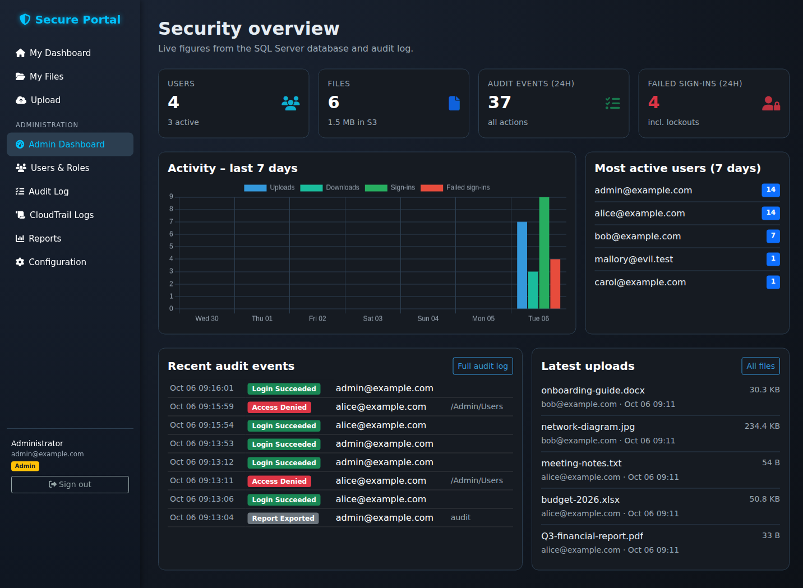

> **Project history.** This started as coursework for *Cloud Services and Security* at
> Óbuda University (Nov 2025, first pushed Dec 2025). That version did the S3 work (encrypted
> uploads, pre-signed downloads, CloudTrail log viewer) but had no database, no working
> login and several simulated screens. In October 2026 it was refactored: the SQL Server
> layer, authentication, roles, ownership checks, audit log, tests and Docker demo described
> below were **added in that refactor**. See [Project history](#project-history).

---

## Contents

- [Problem](#problem) · [Features](#features) · [Screenshots](#screenshots)
- [Architecture](#architecture) · [Security controls](#security-controls)
- [Run it locally](#run-it-locally-docker) · [Run against AWS](#run-against-aws) · [Tests](#tests)
- [Technical decisions](#technical-decisions) · [Challenges](#challenges)
- [Status and limitations](#status-and-limitations) · [Project history](#project-history)

## Problem

Small teams often share documents through ad-hoc buckets or drives with no per-user access
control and no record of who did what. This project is a self-hosted web front end over S3
that keeps the objects private and encrypted, gives each user access only to their own files,
lets an administrator manage accounts and roles, and keeps an application-level audit trail
that sits alongside AWS CloudTrail.

**Intended users:** regular users who upload and retrieve their own documents, and
administrators who manage accounts and review activity.

## Features

| Area | What it does |
|---|---|
| **Authentication** | E-mail + password login, ASP.NET Core `PasswordHasher` (PBKDF2), 5 failed attempts → 15-minute lockout, rate-limited login endpoint, sign-out, access-denied page |
| **Roles** | `Admin` and `User`. Every page requires sign-in by default; admin area is `[Authorize(Roles = "Admin")]`. Role or status changes end the user's existing session on their next request |
| **Files** | Upload with server-side size/extension allow-list; stored in S3 under a random key with SSE-KMS (or SSE-S3); metadata in SQL Server; download through short-lived pre-signed URLs; delete removes object and row |
| **Ownership** | Users see and act only on their own files; admins can view all. Requests use database IDs, never S3 keys; foreign files return 404 |
| **Audit log** | Logins, failures, lockouts, logouts, access denials, uploads (incl. rejected), downloads, deletes, user/role changes, CloudTrail views and report exports - with user, target, IP and outcome. Filterable, paginated, CSV export |
| **Admin dashboard** | Live counts from the database, 7-day activity chart, most active users, recent events, latest uploads |
| **User management** | Create users, promote/demote, activate/deactivate (cannot lock yourself out) |
| **CloudTrail viewer** | Lists `.json.gz` log files in a configured CloudTrail bucket and shows them decompressed. Optional |
| **Reports** | CSV exports: file inventory, audit trail, CloudTrail index (formula-injection safe) |

## Screenshots

All screenshots are from the current code running in the Docker demo below with demo
accounts and a local S3 emulator. CloudTrail entries in the demo are **synthetic fixtures**.

| | |
|---|---|
| **Sign-in** 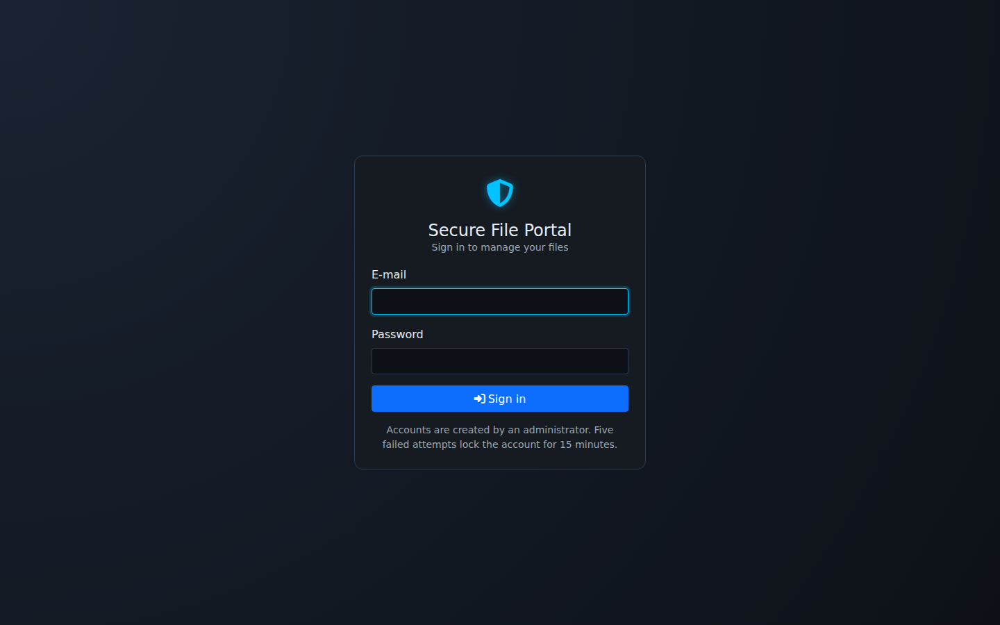 | **User dashboard** 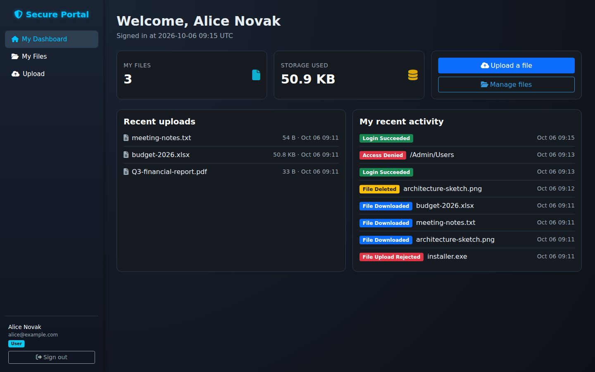 |
| **Upload** 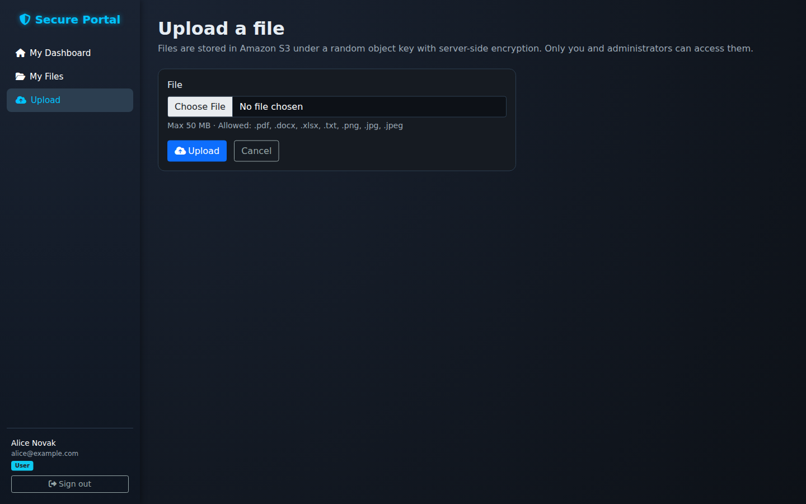 | **My files** 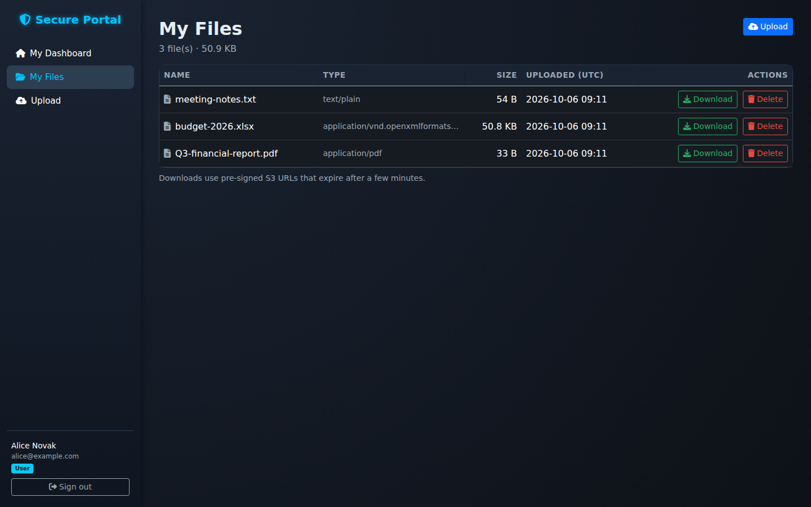 |
| **User blocked from admin area** 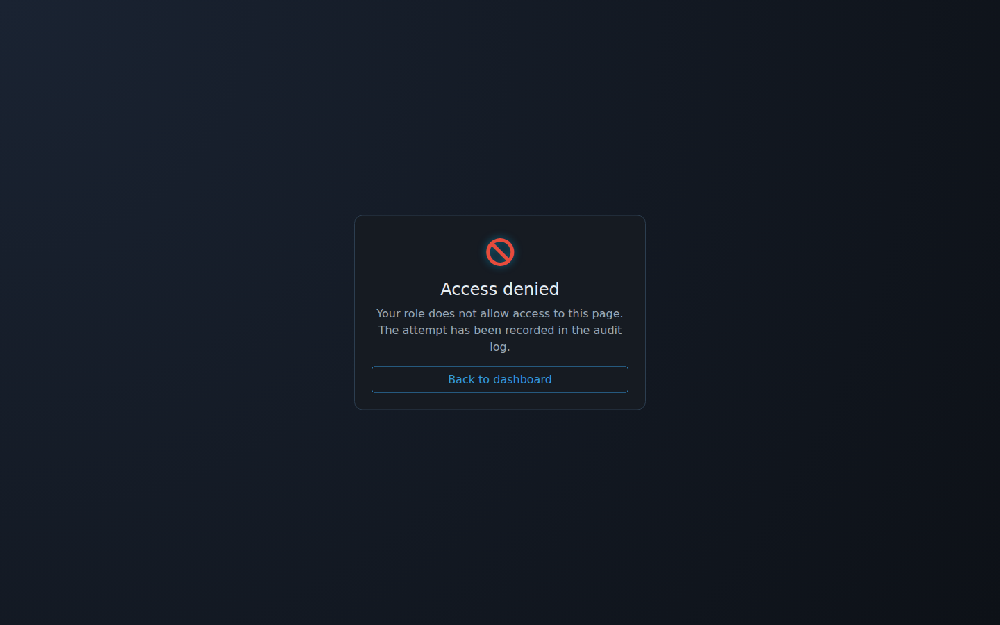 | **Users & roles** 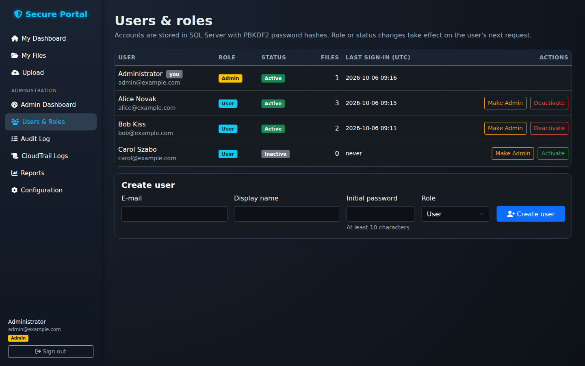 |
| **All files (admin)** 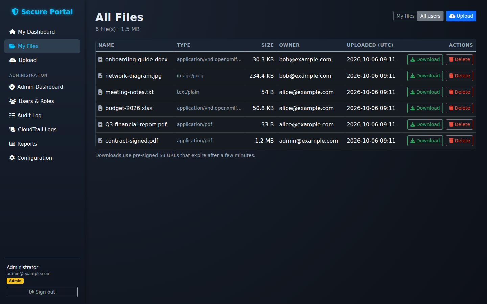 | **Audit log** 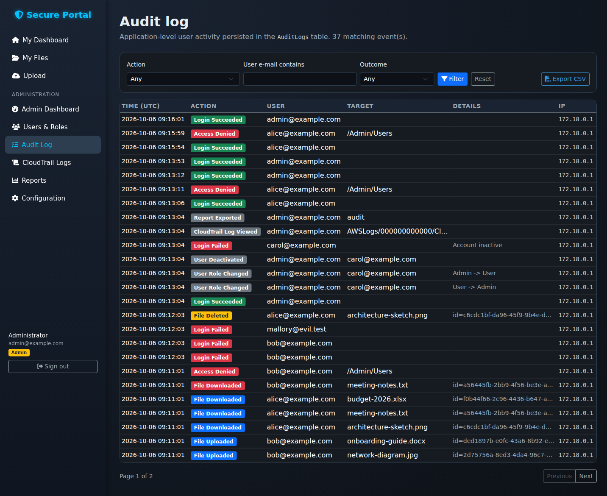 |
| **Audit - failures only** 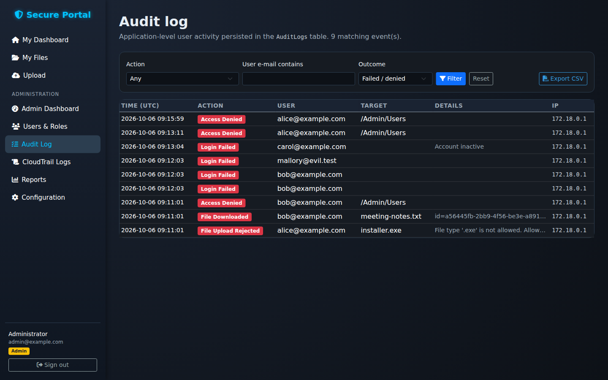 | **CloudTrail viewer** 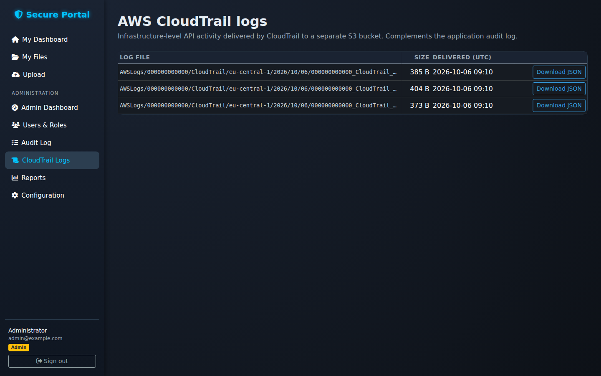 |
| **Reports** 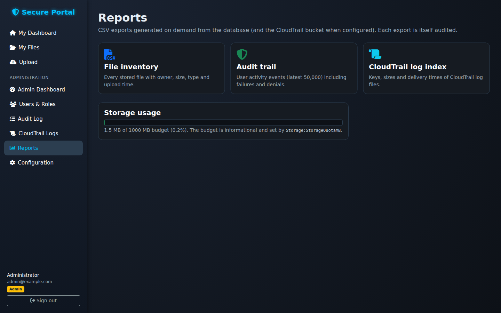 | **Configuration (read-only)** 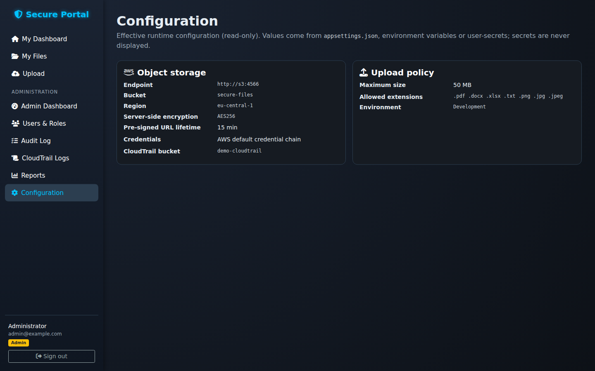 |

Screenshots of the original 2025 coursework UI are kept in
[`docs/screenshots/original-2025`](docs/screenshots/original-2025) for reference.

## Architecture

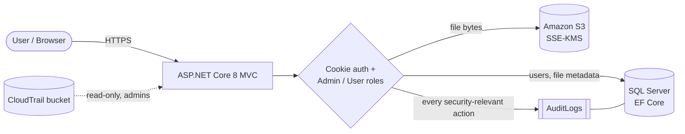

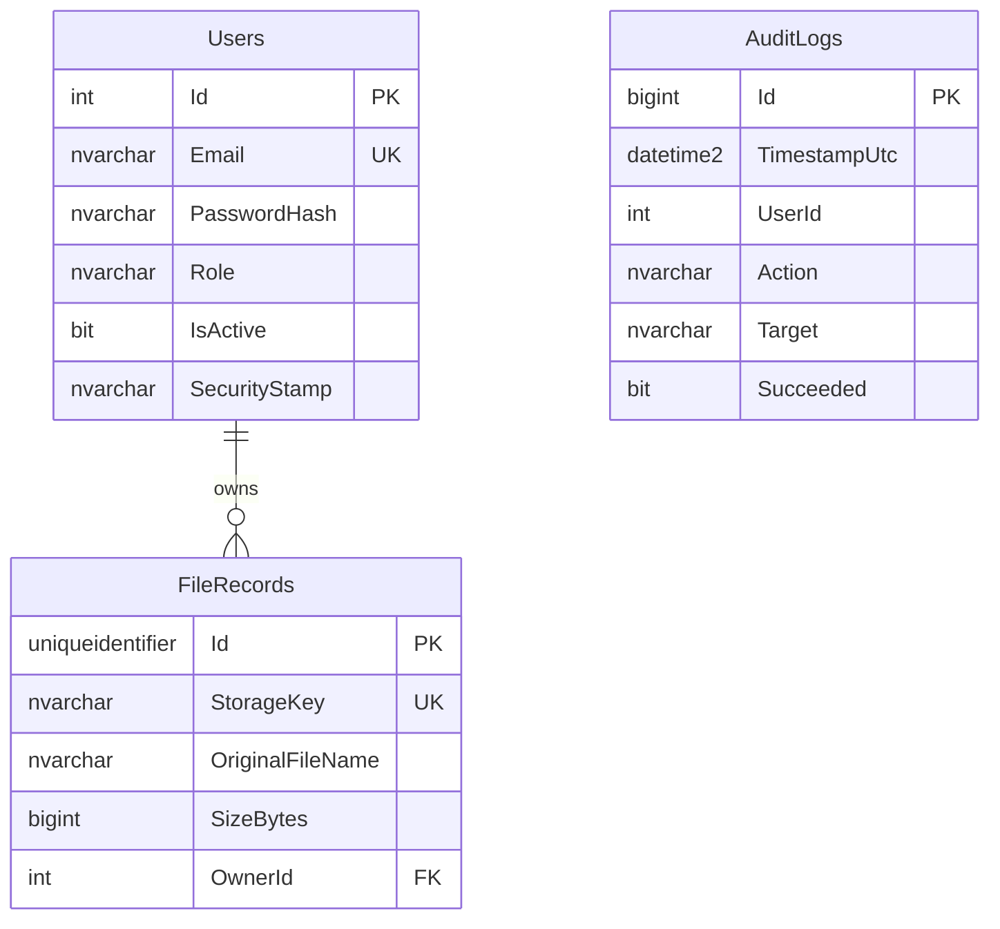

Full component diagram, data model, sign-in/upload sequence diagrams, audit coverage and the
configuration reference are in **[docs/architecture.md](docs/architecture.md)**.

| | |
|---|---|
| Backend | C#, ASP.NET Core 8 MVC, EF Core 8 |
| Database | SQL Server (code-first migrations) |
| Storage | Amazon S3 via AWS SDK for .NET; KMS / AES256 server-side encryption |
| Frontend | Razor views, Bootstrap 5, Font Awesome, Chart.js |
| Tests | xUnit, `WebApplicationFactory` integration tests, EF Core InMemory |
| Local demo | Docker Compose: SQL Server 2022, LocalStack (S3), app container |
| CI | GitHub Actions: build (warnings as errors), tests, migration drift check |

```
SecureFileUploadPortal/
  Controllers/   Account, Home, File, Admin
  Data/          Entities, AppDbContext, DbInitializer, Migrations/
  Security/      cookie validation, claims, file access policy, security headers
  Services/      UserService, AuditService, S3FileStorageService, CloudTrailLogService, UploadValidator, CsvBuilder
  Options/       typed configuration (Storage, Upload, CloudTrail)
  Views/         Razor UI
SecureFileUploadPortal.Tests/   unit + HTTP-level integration tests
deploy/localstack/              bucket bootstrap + synthetic CloudTrail fixtures
```

## Security controls

Implemented and covered by tests unless noted:

- **Passwords** hashed with ASP.NET Core Identity's `PasswordHasher` (PBKDF2); hashes are
  upgraded automatically if the algorithm parameters change. Minimum length 10.
- **Brute force:** account lockout after 5 failures (15 min) and a 10-requests-per-minute
  per-IP limit on `POST /Account/Login`. Unknown e-mails still run a hash to reduce timing
  differences.
- **Session cookie:** `HttpOnly`, `SameSite=Strict`, `Secure` outside Development, 30-minute
  sliding expiry. Each request checks the user still exists, is active and that the security
  stamp is unchanged - so deactivation or a role change takes effect immediately.
- **Authorization:** authenticated-by-default fallback policy, admin-only controller, and an
  ownership check on every file action. Denials are audited.
- **CSRF:** antiforgery validation on all unsafe requests.
- **Uploads:** size limit enforced by Kestrel and the validator, extension allow-list, file
  name stripped of paths, content type derived from the extension (client MIME ignored),
  random S3 object key.
- **Storage:** server-side encryption header on every `PutObject` (`aws:kms` by default,
  optional customer-managed key); downloads via pre-signed URLs (default 15 min) with a
  sanitised `Content-Disposition`. Bucket public-access blocking is an AWS-side setting
  (applied automatically in the local demo).
- **Headers:** `X-Content-Type-Options`, `X-Frame-Options: DENY`, `Referrer-Policy`,
  `Permissions-Policy`, HSTS outside Development.
- **Errors:** generic error pages; details go to the server log via `ILogger`.
- **Secrets:** nothing committed. AWS access uses the SDK default credential chain (IAM role,
  profile or environment); the DB connection string and seed admin come from environment
  variables or `dotnet user-secrets`.

## Run it locally (Docker)

Needs Docker with Compose. No AWS account required - S3 is emulated by
[LocalStack](https://github.com/localstack/localstack).

```bash
git clone https://github.com/Mighiana/Cloud-Based-Secure-File-Management-System.git
cd Cloud-Based-Secure-File-Management-System
cp .env.example .env          # then set MSSQL_SA_PASSWORD and SEED_ADMIN_PASSWORD
docker compose up -d --build
```

Open <http://localhost:8080> and sign in with `SEED_ADMIN_EMAIL` / `SEED_ADMIN_PASSWORD`
from `.env`. From **Users & roles** create a normal user, sign in as them in a private window
and try uploading, downloading and opening an admin page; then check the **Audit log** as admin.

What compose starts:

| Service | Purpose |
|---|---|
| `sqlserver` | SQL Server 2022 Developer; schema created by EF migrations on app start |
| `s3` | LocalStack S3; `deploy/localstack/init-s3.sh` creates a private, encrypted `secure-files` bucket and a `demo-cloudtrail` bucket with three synthetic log files |
| `app` | this application on port 8080, non-root, Data Protection keys on a volume |

`docker compose down -v` removes everything including data.

### Without Docker (`dotnet run`)

Needs the .NET 8 SDK, a SQL Server instance (or LocalDB) and S3 or an S3-compatible endpoint.

```bash
cd SecureFileUploadPortal
dotnet user-secrets set "ConnectionStrings:DefaultConnection" "Server=localhost;Database=SecureFilePortal;User Id=sa;Password=...;TrustServerCertificate=True"
dotnet user-secrets set "Seed:AdminEmail" "admin@example.com"
dotnet user-secrets set "Seed:AdminPassword" "<at least 10 characters>"
dotnet user-secrets set "Storage:BucketName" "<your bucket>"
dotnet run
```

`appsettings.Development.json` points S3 at LocalStack on `localhost:4566` and applies
migrations on start-up. Remove the `Storage:ServiceUrl` override to use real AWS.

## Run against AWS

1. Create a private S3 bucket (Block Public Access on) and, optionally, a KMS key.
2. Give the app an IAM role/user allowed `s3:PutObject`, `s3:GetObject`, `s3:DeleteObject`,
   `s3:ListBucket` on that bucket (+ `kms:GenerateDataKey`/`kms:Decrypt` on the key), and
   `s3:GetObject`/`s3:ListBucket` on the CloudTrail bucket if you use the viewer.
3. Provide configuration as environment variables, for example:

   ```bash
   ConnectionStrings__DefaultConnection="Server=...;Database=SecureFilePortal;..."
   Storage__BucketName=my-secure-files
   Storage__Region=eu-central-1
   Storage__ServerSideEncryption=aws:kms
   Storage__KmsKeyId=arn:aws:kms:...      # optional
   CloudTrail__BucketName=my-cloudtrail-bucket   # optional
   CloudTrail__AccountId=123456789012            # optional
   Seed__AdminEmail=... Seed__AdminPassword=...  # first run only
   DataProtection__KeysPath=/var/keys            # shared/persistent storage
   ```
4. Apply migrations (`dotnet ef database update` or `Database__ApplyMigrationsOnStartup=true`).
5. Terminate TLS in front of the app (or in Kestrel); set `UseHttpsRedirection=false` only
   when a proxy handles HTTPS.

Credentials are resolved by the AWS SDK default chain; do not put access keys in config.
The full option list is in [docs/architecture.md](docs/architecture.md#configuration).
**There is currently no public live deployment.**

## Tests

```bash
dotnet test SecureFileUploadPortal.sln
```

60 tests. Unit tests cover the upload validator, ownership policy, CSV escaping,
CloudTrail key validation, password hashing, lockout, role changes and security-stamp
rotation. Integration tests boot the real app with `WebApplicationFactory`, an in-memory
database and a fake S3 store, and check over HTTP: anonymous redirects, antiforgery,
login + audit, admin-only pages, upload validation and MIME handling, cross-user
download/delete denial, and that deactivating a user invalidates their existing cookie.

## Technical decisions

- **Metadata in SQL, bytes in S3.** Ownership, original names and audit history need
  relational queries; S3 keys are random so no user input ever becomes an object key.
- **Cookie auth + a small `Users` table instead of full ASP.NET Core Identity.** Two roles and
  e-mail/password login don't need Identity's schema; the Identity `PasswordHasher` is reused
  so hashing is not hand-rolled. A security stamp gives immediate revocation.
- **Authenticated-by-default.** A fallback policy means a new controller can't be
  accidentally public; public endpoints opt in with `[AllowAnonymous]`.
- **404 for other users' files** so IDs can't be probed, but the attempt is still audited.
- **Pre-signed downloads** keep file bytes off the web server and expire quickly.
- **Audit log without a foreign key** so history is never cascaded away.
- **Storage behind `IFileStorageService`** so integration tests run without AWS and the app
  works with any S3-compatible endpoint.
- **Removed simulated features** (Macie scan, Glacier backup, browser-only MFA toggle,
  hard-coded charts/users) instead of keeping UI that pretended to work.

## Challenges

- **Making the original code actually secure.** It referenced a cookie scheme that was never
  registered and had no `[Authorize]`, so every page - including delete - was public. Fixing
  this meant adding a user store, hashing, roles and a default-deny policy rather than patching
  one attribute.
- **Local S3 that behaves like AWS.** Pre-signed URLs must be signed for the host the browser
  sees, not the Docker-internal hostname, and with the right scheme; this led to separate
  `ServiceUrl` / `PublicServiceUrl` settings and path-style addressing.
- **Keeping S3 and the database consistent.** An upload that reaches S3 but fails to save
  metadata deletes the object again; delete removes the object before the row.
- **Separating application audit from CloudTrail.** CloudTrail shows AWS API calls by the
  app's IAM identity, not which portal user triggered them - hence a dedicated `AuditLogs` table.

## Status and limitations

**Working:** everything in [Features](#features), verified with the test suite and in the
Docker demo against SQL Server and LocalStack S3.

**Not implemented** (some appear in the original coursework report as design ideas):

- multi-factor authentication
- malware/content scanning (e.g. Macie or Lambda-based)
- Glacier archival / lifecycle management from the app (can be set as an S3 lifecycle rule)
- SNS/e-mail alerts and CloudWatch dashboards
- self-service registration and password reset
- parsing or correlating CloudTrail events (the viewer shows raw JSON)
- file sharing between users, versioning, folders

Data Protection keys are stored unencrypted on the configured path; production should add
key encryption (e.g. `ProtectKeysWithCertificate` or AWS KMS) or a managed key store.

## Project history

| When | What |
|---|---|
| Nov 2025 | Coursework for *Cloud Services and Security*, Óbuda University (report and presentation). AWS-side setup (S3, KMS, CloudTrail) was configured in the console. |
| Dec 2025 | Code pushed: S3 upload/list/download/delete with SSE-KMS and pre-signed URLs, CloudTrail log viewer, CSV exports, admin UI. Several screens were placeholders. |
| Oct 2026 | Refactor: SQL Server + EF Core, password hashing, roles, ownership checks, persistent audit log, user management, removal of simulated features, configuration/secrets cleanup, tests, CI and Docker demo. |
