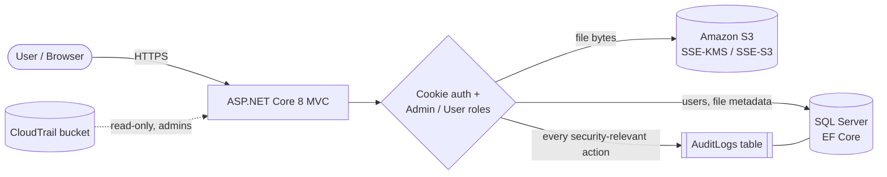
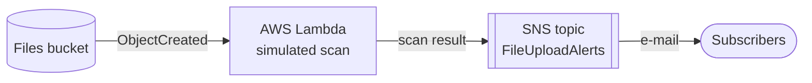
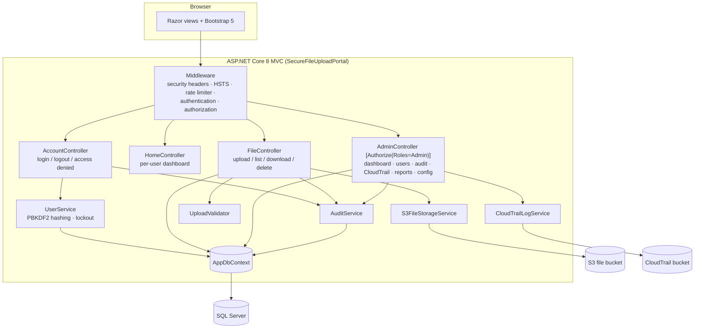
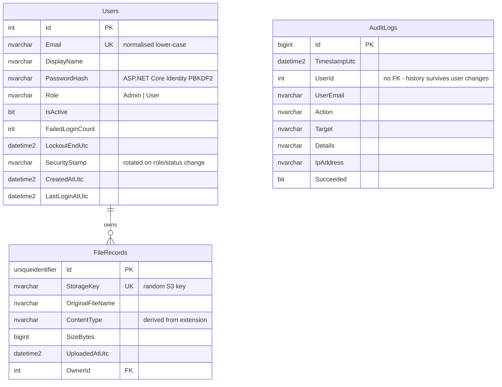
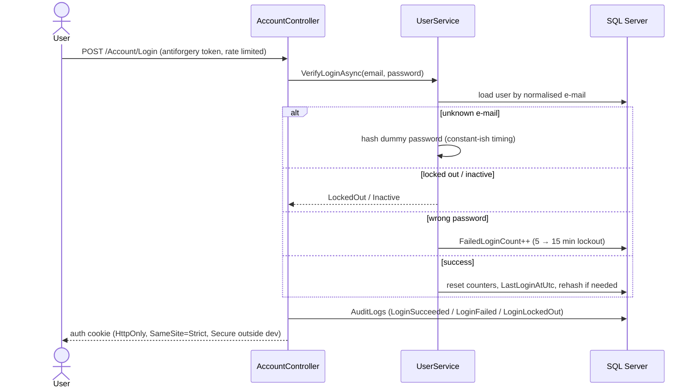
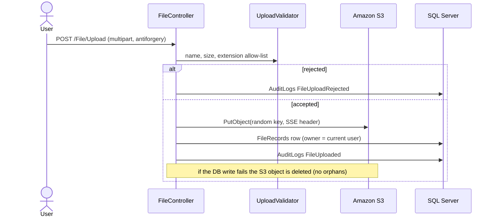

# Architecture

This document describes the application as implemented in this repository. Anything
configured only in the AWS console (see [Project history](../README.md#project-history))
is called out separately.

## High-level flow

### Upload-scan Lambda (2025 console build, reconstructed as code in 2026)

The coursework deployment had an S3-triggered Lambda that performed a basic (simulated) check
on each upload and sent "scan successful / failed" e-mails through SNS. It was built in the AWS
console and its original code was never committed. [`lambda/upload-scan`](../lambda/upload-scan)
is a 2026 reconstruction (size / extension / file-signature checks, `scan-status` object tags,
SNS e-mail) with Terraform in [`deploy/aws/upload-scan`](../deploy/aws/upload-scan). It runs
independently of the web application, which does not read the tags.

## Components

| Layer | Implementation |
|---|---|
| Presentation | Razor views, Bootstrap 5, Font Awesome, Chart.js (admin activity chart only) |
| Web / security | Cookie authentication, global "authenticated user" fallback policy, `[Authorize(Roles = "Admin")]`, global antiforgery validation, fixed-window rate limit on login, security headers |
| Domain services | `UserService`, `AuditService`, `UploadValidator`, `FileAccessPolicy`, `CsvBuilder` |
| Persistence | EF Core 8 + SQL Server, code-first migrations in `Data/Migrations` |
| Object storage | AWS SDK for .NET (`AWSSDK.S3`), any S3-compatible endpoint for local dev |

## Data model

`AuditLogs` deliberately has no foreign key so audit history is never cascaded or blocked by
user changes. `FileRecords → Users` uses `DeleteBehavior.Restrict`.

## Key workflows

### Sign-in

Every request re-validates the cookie against the database (`CookieValidator`): if the
user was deactivated or their role changed (security stamp rotated) the session ends on
the next request.

### Upload

### Download / delete

1. The request carries the `FileRecords.Id` (GUID), never an S3 key.
2. `FileAccessPolicy.CanAccess` allows the owner or an Admin; anything else is audited as a
   failed `FileDownloaded` / `FileDeleted` and answered with **404** (no existence oracle).
3. Download redirects to a pre-signed GET URL (default 15 min) with a sanitised
   `Content-Disposition: attachment` file name. Delete removes the S3 object, then the row.

## Audit coverage

| Area | Actions recorded |
|---|---|
| Authentication | `LoginSucceeded`, `LoginFailed`, `LoginLockedOut`, `Logout`, `AccessDenied` |
| Files | `FileUploaded`, `FileUploadRejected`, `FileUploadFailed`, `FileDownloaded`, `FileDeleted` (failed attempts with `Succeeded = false`) |
| Administration | `UserCreated`, `UserRoleChanged`, `UserActivated`, `UserDeactivated`, `CloudTrailLogViewed`, `ReportExported` |

Each row stores timestamp, user id/e-mail, target, details, client IP and outcome. Admins can
filter by action, user and outcome, and export to CSV (formula-injection safe).

**Application audit log vs. CloudTrail:** the `AuditLogs` table answers *"which portal user did
what"*. CloudTrail (optional, separate bucket) answers *"which AWS principal called which S3
API"*. The portal lists and decompresses CloudTrail `.json.gz` files but does not parse or
correlate them.

## Configuration

All settings are bound to typed options and can be supplied via `appsettings.json`,
environment variables (`Section__Key`) or `dotnet user-secrets`.

| Key | Purpose | Default |
|---|---|---|
| `ConnectionStrings:DefaultConnection` | SQL Server connection | — (required) |
| `Database:ApplyMigrationsOnStartup` | run EF migrations at start-up | `false` (`true` in Development) |
| `Seed:AdminEmail` / `Seed:AdminName` / `Seed:AdminPassword` | first administrator, only if the Users table is empty | — |
| `Storage:BucketName` | S3 bucket for files | — (required) |
| `Storage:Region` | AWS region | `eu-central-1` |
| `Storage:ServiceUrl` / `Storage:PublicServiceUrl` / `Storage:ForcePathStyle` | S3-compatible endpoint (LocalStack, MinIO) | — |
| `Storage:ServerSideEncryption` / `Storage:KmsKeyId` | `aws:kms`, `AES256` or `None`; optional CMK | `aws:kms` |
| `Storage:PresignedUrlMinutes` | download link lifetime | `15` |
| `Storage:StorageQuotaMB` | informational budget on the Reports page | `1000` |
| `CloudTrail:BucketName` / `CloudTrail:AccountId` | optional CloudTrail viewer | — (feature hidden) |
| `Upload:MaxFileSizeMB` / `Upload:AllowedExtensions` | upload policy | `50` / pdf, docx, xlsx, txt, png, jpg, jpeg |
| `DataProtection:KeysPath` | persist cookie/antiforgery keys | in-memory/user profile |
| `UseHttpsRedirection` | disable behind a TLS-terminating proxy | `true` |

AWS credentials are **not** configuration: the SDK default credential chain is used (IAM role
on EC2/ECS/App Runner, `AWS_PROFILE`, or environment variables). `Storage:AccessKey` /
`Storage:SecretKey` exist only for S3-compatible local endpoints.
