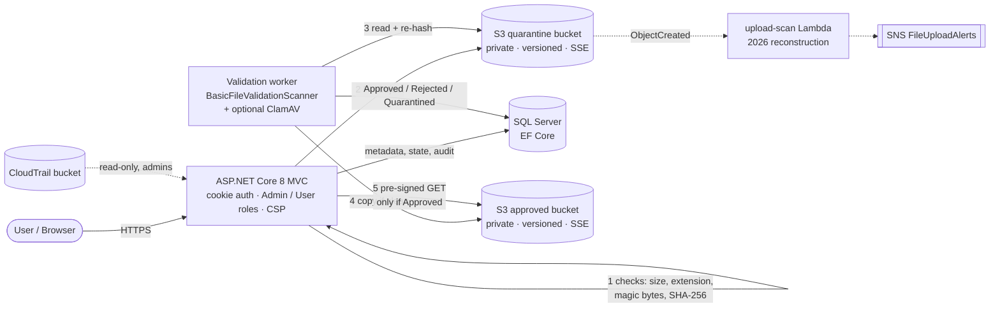
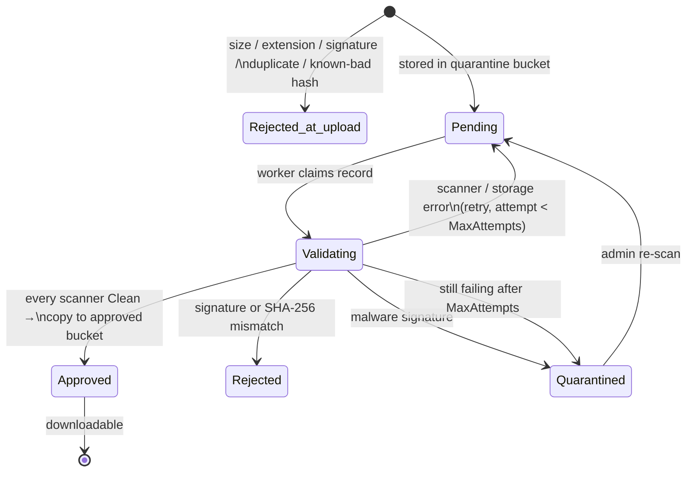
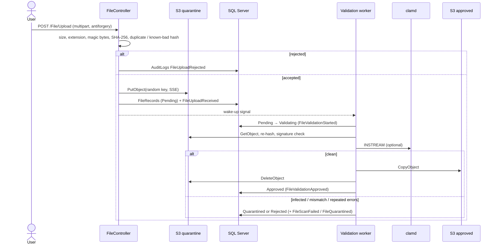
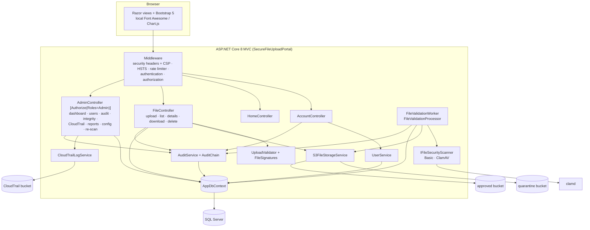
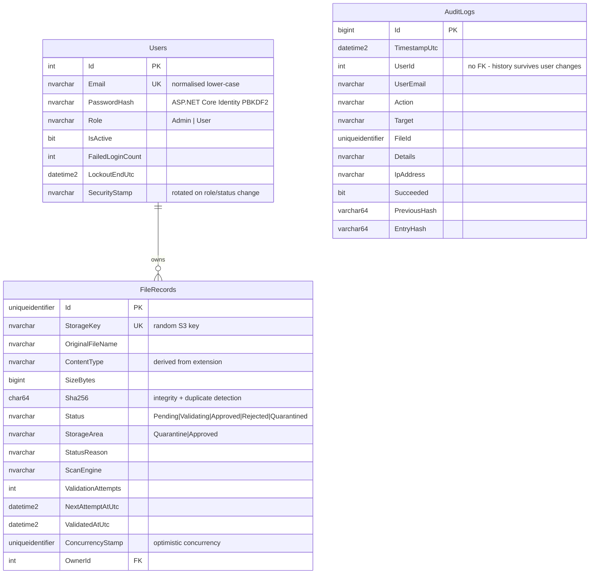

# Architecture

This document describes the application as implemented in this repository. Work that only
existed in the AWS console in 2025 is called out separately (see
[Project history](../README.md#project-history)).

## High-level flow

## File security pipeline

1. **Upload (`FileController.Upload`).** File name stripped of paths; size and extension
   allow-list; the first bytes must match the extension (`FileSignatures`: `%PDF-`, PNG, JPEG,
   ZIP for `.docx`/`.xlsx`, no binary bytes in `.txt`; Windows/ELF/Mach-O executables and `#!`
   scripts are always refused). SHA-256 is computed over the stream. Exact duplicates for the
   same user and any file whose hash matches a quarantined file are refused. The content type
   is derived from the validated extension (client MIME is ignored). The object goes to the
   **quarantine** bucket under a random key, a `FileRecords` row is created as `Pending` and
   `FileUploadReceived` is audited with the size and hash.
2. **Validation (`FileValidationWorker` → `FileValidationProcessor`).** A hosted service polls
   for due `Pending` records (and is woken immediately after an upload), claims each one by
   setting `Validating` (optimistic concurrency on `ConcurrencyStamp`), and runs every
   registered `IFileSecurityScanner` in order:
   - `BasicFileValidationScanner` (always): re-reads the stored object, checks size, signature
     and that its SHA-256 equals the upload-time hash.
   - `ClamAvSecurityScanner` (when `Validation:ClamAv:Enabled`): streams the object to clamd
     over `INSTREAM`.
3. **Decision.** All scanners `Clean` → copy to the **approved** bucket, delete from quarantine,
   `Approved`. Content/integrity failure → `Rejected`. Malware signature → `Quarantined`.
   Scanner or storage error → back to `Pending` with a back-off; after `MaxAttempts` the file is
   `Quarantined`. A scanner outage never approves a file. Records stuck in `Validating`
   longer than `StaleAfterMinutes` (e.g. after a crash) are re-queued.
4. **Download gate (`FileController.Download`).** Ownership check first, then
   `IsDownloadable` (`Status == Approved && StorageArea == Approved`). Otherwise no URL is
   generated, `DownloadBlockedSecurityState` is audited and the user sees the file's state.
   `GetApprovedDownloadUrl` can only sign URLs for the approved bucket.

The worker runs inside the web process by default (`Validation:RunWorker`). It can be split
into its own process with its own IAM role (`validator_in_web_process = false` in Terraform).

### Upload sequence

## Upload-scan Lambda (2025 console build, reconstructed as code in 2026)

The coursework deployment had an S3-triggered Lambda that performed a basic (simulated) check
on each upload and sent "scan successful / failed" e-mails through SNS. It was built in the AWS
console and its code was never committed. [`lambda/upload-scan`](../lambda/upload-scan) is a
2026 reconstruction, deployed by [`deploy/aws`](../deploy/aws) on the quarantine bucket:
size / extension / signature checks, `scan-status` and `scan-etag` object tags, SNS alerts,
duplicate-event suppression, SQS dead-letter queue. It is an independent alerting path: the
web application does not read its tags, and approval is decided only by the worker.

## Components

## Data model

The `FileSecurityPipeline` migration marks rows uploaded before the pipeline existed as
non-approved, so legacy files are not downloadable until an admin re-scans them.

## Audit log

| Area | Actions recorded |
|---|---|
| Authentication | `LoginSucceeded`, `LoginFailed`, `LoginLockedOut`, `Logout`, `AccessDenied` |
| Upload | `FileUploadReceived` (size + SHA-256), `FileUploadRejected` (reason), `FileUploadFailed` |
| Validation | `FileValidationStarted`, `FileValidationApproved`, `FileValidationRejected`, `FileScanFailed`, `FileQuarantined`, `FileRescanRequested` |
| Access | `FileDownloaded`, `DownloadBlockedSecurityState`, `FileDeleted` (failed attempts with `Succeeded = false`) |
| Administration | `UserCreated`, `UserRoleChanged`, `UserActivated`, `UserDeactivated`, `CloudTrailLogViewed`, `ReportExported`, `AuditChainVerified` |

Rows never contain passwords, tokens, AWS credentials, pre-signed URLs or file contents.

**Hash chain.** `AuditService` serialises appends (in-process lock plus SQL Server
`sp_getapplock`), takes the previous row's `EntryHash` (64 zeroes for the first row) and
stores `EntryHash = SHA-256(canonical JSON of the row's fields + PreviousHash)`.
`AuditChain.VerifyAsync` walks the table in `Id` order and reports the first edited row,
broken link (deleted row) or count of legacy rows without a hash. This is
**tamper-evident**: a database user with write access can recompute the whole chain, and
deleting the newest rows is only visible if the head hash was recorded elsewhere.

**Application audit log vs. CloudTrail:** `AuditLogs` answers *"which portal user did what"*.
CloudTrail (optional, separate bucket) answers *"which AWS principal called which S3 API"*.
The portal lists and decompresses CloudTrail `.json.gz` files but does not parse or correlate
them.

## Infrastructure as code (`deploy/aws`)

| File | Contents |
|---|---|
| `storage.tf` | quarantine, approved and access-log buckets: Public Access Block, `BucketOwnerEnforced`, versioning, SSE-S3 (or SSE-KMS with `kms_key_arn`), lifecycle (expire quarantine objects and old versions, abort incomplete multipart uploads), server access logging, TLS-only + TLS ≥ 1.2 bucket policies |
| `iam.tf` | separate roles: **web** (put/delete quarantine, get/delete approved, optional CloudTrail read), **validator** (get/delete/tag quarantine, put approved), optional KMS statements |
| `upload_scan.tf` | Lambda (Python 3.12, reserved concurrency, async retry config, SQS DLQ, log group with retention), SNS topic + optional e-mail subscriptions, quarantine-bucket notification, Lambda role (get/tag quarantine, publish SNS, send DLQ, own logs) |
| `tests/security.tftest.hcl` | `terraform test` with a mocked AWS provider: private/versioned/encrypted buckets, TLS-only policies, no wildcard IAM actions/resources, web role cannot write to approved, SSE-KMS switch, Lambda toggle, input validation |

`make check` runs `terraform fmt -check`, `validate`, `test`, TFLint and Checkov without AWS
credentials. Checkov skips are written inline with a reason (e.g. cross-region replication
and SSE-KMS-by-default are cost decisions). Paid services (GuardDuty, Macie, WAF, Security
Hub, Inspector) are not used.

## Configuration

All settings are bound to typed options and can be supplied via `appsettings.json`,
environment variables (`Section__Key`) or `dotnet user-secrets`.

| Key | Purpose | Default |
|---|---|---|
| `ConnectionStrings:DefaultConnection` | SQL Server connection | — (required) |
| `Database:ApplyMigrationsOnStartup` | run EF migrations at start-up | `false` (`true` in Development) |
| `Seed:AdminEmail` / `Seed:AdminName` / `Seed:AdminPassword` | first administrator, only if the Users table is empty | — |
| `Storage:QuarantineBucketName` / `Storage:ApprovedBucketName` | the two file buckets | — (required) |
| `Storage:Region` | AWS region | `eu-central-1` |
| `Storage:ServiceUrl` / `Storage:PublicServiceUrl` / `Storage:ForcePathStyle` | S3-compatible endpoint (LocalStack) and the host the browser sees | — |
| `Storage:ServerSideEncryption` / `Storage:KmsKeyId` | `AES256` (SSE-S3), `aws:kms` or `None`; optional CMK | `AES256` |
| `Storage:PresignedUrlMinutes` | download link lifetime | `15` |
| `Upload:MaxFileSizeMB` / `Upload:AllowedExtensions` | upload policy (only extensions with a signature check are honoured) | `50` / pdf, docx, xlsx, txt, png, jpg, jpeg |
| `Validation:RunWorker` | run the validation worker in this process | `true` |
| `Validation:PollSeconds` / `BatchSize` / `MaxAttempts` / `RetryDelaySeconds` / `StaleAfterMinutes` | worker tuning | `5` / `10` / `3` / `30` / `5` |
| `Validation:ClamAv:Enabled` / `Host` / `Port` / `TimeoutSeconds` | optional ClamAV scanner | `false` / `localhost` / `3310` / `60` |
| `Security:LoginAttemptsPerMinute` | per-IP limit on `POST /Account/Login` | `10` |
| `CloudTrail:BucketName` / `CloudTrail:AccountId` | optional CloudTrail viewer | — (feature hidden) |
| `DataProtection:KeysPath` | persist cookie/antiforgery keys | in-memory/user profile |
| `UseHttpsRedirection` | disable behind a TLS-terminating proxy | `true` |

AWS credentials are **not** configuration: the SDK default credential chain is used (IAM role
on EC2/ECS/App Runner, `AWS_PROFILE`, or environment variables). `Storage:AccessKey` /
`Storage:SecretKey` exist only for S3-compatible local endpoints.
